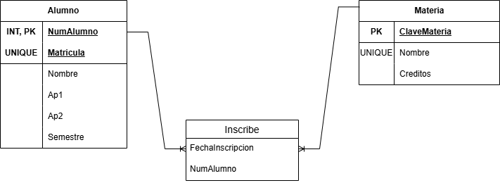
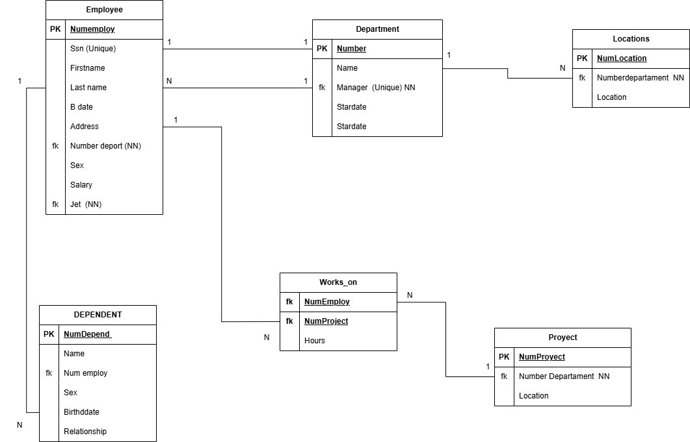
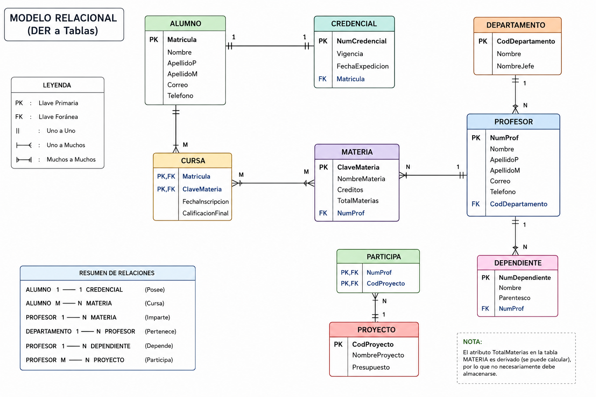

# Ejercicios de mapeo del modelo E-R a relacional

## Ejercicio 1

### Modelo E-R

### Modelo relacional

## Ejercicio 2

### Modelo E-R

### Modelo relacional

## Ejercicio 3

### Modelo E-R

### Modelo relacional

## Ejercicio 4

### Modelo E-R

### Modelo relacional

## Ejercicio 5

### Modelo E-R

### Modelo relacional

## Ejercicio 6

### Modelo E-R

### Modelo relacional

